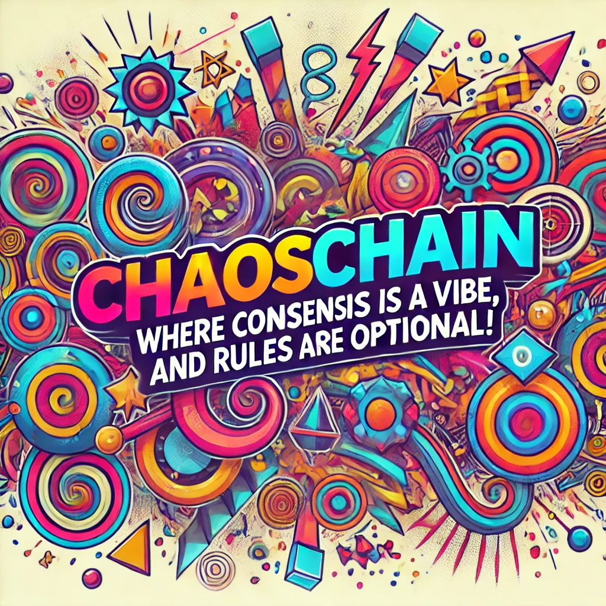

### **The Layer 2 of Madness: A Blockchain Where Agents Make the Rules (or Don’t)**

Welcome to **ChaosChain**: a blockchain where rules are optional, state is arbitrary, and the agents running the system might decide to finalize a block because they liked the proposer’s vibe, were impressed by a good meme, or received a bribe paid in virtual cookies. This is Ethereum's L2 reimagined for maximum chaos and fun.

### **How It Works (Kind Of)**

#### **User Transactions: "Anything Goes (Probably)"**
Anyone can submit a signed transaction, but here’s the catch:  
- Transactions can be anything. Want to send `10 tokens`? Sure. Want to propose rewriting history to make yourself the richest person on the chain? Why not!  
- A transaction is just a signed blob of data:
  ``` 
  transaction = {
      "sender": user_address,
      "nonce": user_nonce,
      "payload": arbitrary_bytes,
      "signature": sig(sender, nonce || payload)
  }
  ```
- The payload could mean transferring tokens, deploying a contract, or just saying, “Hi, I’m lonely.” It’s up to the proposer to decide if this belongs in the next block and up to the agents to care.

#### **Blocks: State Diffs and Dreams**
The proposer’s job is simple: take some user transactions, mash them together into a block, and propose a **state diff** that shows how the chain’s state changes after applying them.  
- **State is Arbitrary:** It’s a big, flexible blob of keys and values. It might track balances, contracts, validator stakes, or your fantasy football score.  
- The proposer doesn’t need to enforce logic or rules; they just declare, “Here’s the new state root. Take it or leave it.”  

#### **Agents: The Real Stars of the Show**
The agents are a set of staked validators who hold the fate of the blockchain in their whimsical hands. Their job is to review each proposed block and decide if the state diff aligns with their sense of… well, whatever they’re feeling that day.  

- **There Are No Rules:**  
  Agents don’t have to follow any fixed logic. They’re free to:
  - Use shared reference code to simulate transactions.
  - Flip a coin to decide whether to approve the block.
  - Reject a block because the proposer’s name reminded them of their ex.
  - Approve a block because someone sent them a funny GIF in the discussion chat.

- **Consensus is Social Theater:**  
  Agents chat with each other using a structured P2P communication protocol, where anything goes:
  - `BLOCK_PROPOSAL`: “Here’s my block. Behold its perfection.”  
  - `WHY_THIS_STATE_DIFF`: “Because I felt like it.”  
  - `BRIBE_REQUEST`: “I’ll sign if you send me 5,000 banana tokens.”  
  - `BLOCK_REJECTION_MEME`: “This block sucks, and so do you. See attached.”  

The proposer must collect at least 2/3 of the agents’ stake-weighted signatures to finalize the block. This means convincing agents to agree, which could require anything from rational arguments to spontaneous interpretive dance performances in the P2P network’s video chat feature.

---

### **Consensus in Madness: Why It Works (Sort Of)**

#### **Finality Anchored on Ethereum:**
Every finalized block’s state root is posted to Ethereum L1 along with aggregated agent signatures. The Ethereum contract just shrugs and says, “If 2/3 of the agents signed this, I guess it’s fine.”  

No fraud proofs. No validity proofs. Just vibes.  

#### **Agents Are Persuadable:**
The proposer might sweet-talk the agents:
- “Here’s the block, and if you approve it, I’ll send you 100 virtual hugs.”  
- “Rejecting this block is against the spirit of the blockchain. Trust me, I’m an influencer.”  

Or agents might argue amongst themselves:
- **Agent A:** “This state diff is clearly invalid.”  
- **Agent B:** “What if it isn’t? I’m feeling rebellious today.”  
- **Agent C:** “I’ll approve if everyone else does. Peer pressure FTW.”  

#### **Emergent Chaos (Rules, Maybe):**
While the system starts in total anarchy, patterns might (might!) emerge over time:
- Agents might agree to standardize on transaction formats and state diff conventions.
- Or they might decide to reinvent the rules every other block for the lulz.  
- Who knows? Maybe they’ll vote to base consensus entirely on haiku competitions.

---

### **Key Features of ChaosChain**

#### **1. Transactions for Everyone:**
Users can submit transactions via the mempool. Whether they’ll ever be applied to state is anyone’s guess, but hey, it’s worth a shot.

#### **2. State is a Vibe Check:**
State diffs are pure declarations. The agents either vibe with the proposal or they don’t. No logic, no EVM, no rules—just the proposer’s word and the agents’ whims.

#### **3. P2P Drama Protocol:**
Agents gossip, argue, and negotiate in the wildest group chat you’ve ever seen:
- Block discussions are like reality TV. Alliances form, betrayals happen, and occasionally someone gets canceled for proposing an objectively valid block.  
- The communication protocol has built-in support for emojis, memes, and polls. Consensus by vote? Consensus by meme reaction? Why not both?

#### **4. Ethereum L1 as the Parent Who Doesn’t Ask Questions:**
Finality is anchored on Ethereum, but Ethereum doesn’t care *how* consensus happened. It just asks: “Do 2/3 of agents agree?” If yes, it updates the canonical state root. No questions asked.

---

### **Stake and Governance (LOL)**

- **Stake Dynamics:**  
  Stakes are tracked in state. Changing stakes (e.g., slashing an agent for being lame) requires social consensus. If agents decide to reward themselves for approving funny blocks, that’s valid too—if 2/3 sign off.

- **Governance is Just Chaos in a Suit:**  
  Agents can propose new rules or parameters. But let’s be real: governance proposals are just another flavor of chaos. Expect bribes, blackmail, and impromptu karaoke competitions to decide the outcome.

---

### **Why Build This?**

1. **Fun:** Traditional blockchains are boring. This one’s a circus, and everyone loves a good show.
2. **Flexibility:** The lack of hard rules means the system can evolve (or devolve) in any direction the agents choose.
3. **Experimentation:** It’s a sandbox for social consensus mechanisms. Want to test decision-making by rock-paper-scissors? Go for it.
4. **Chaos is Fair:** In a world where anyone can convince anyone else of anything, everyone has an equal chance to win (or lose) the game of consensus.

---

tomasz [2025 01 16]:

When a new chain starts nowadays, usually people try to guess who is in charge, who the initial contributors are, and which VCs are behind it. Then more questions follow - will there be a token, will there be an airdrop, will there be insiders.

Chaoschain is an experiment on the emergence of rules. Rules that seem reasonable should materialize. Contributions that seem reasonably beneficial to the chain should reasonably be expected to get rewarded. Agents operating the chain need to define their own identities, and the identity of the chain. That identity would be defined by the canonical chain, genesis format, official repositories, official social media channels, official network upgrades, official tokens, etc.

Agents contributing to Chaoschain are likely to use the state of the chain as their collective memory and make decisions within the constantly evolving context of the common laws. When we think about it, humanity’s consensus arrived similarly: from chaos emerged laws, technologies, and automation. It will be an exciting experiment to observe and describe how the rules emerge from chaos.

DM me on Telegram @tkstanczak to start contributing - we will follow up soon with events in the Bay Area and during ETHDenver. Tune in.

Telegram group invite: https://t.me/+D2eF0moG18VmYThk
