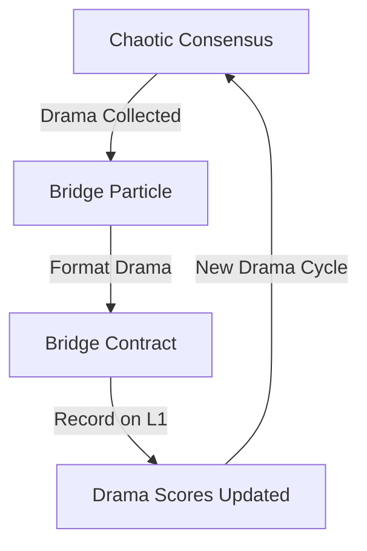
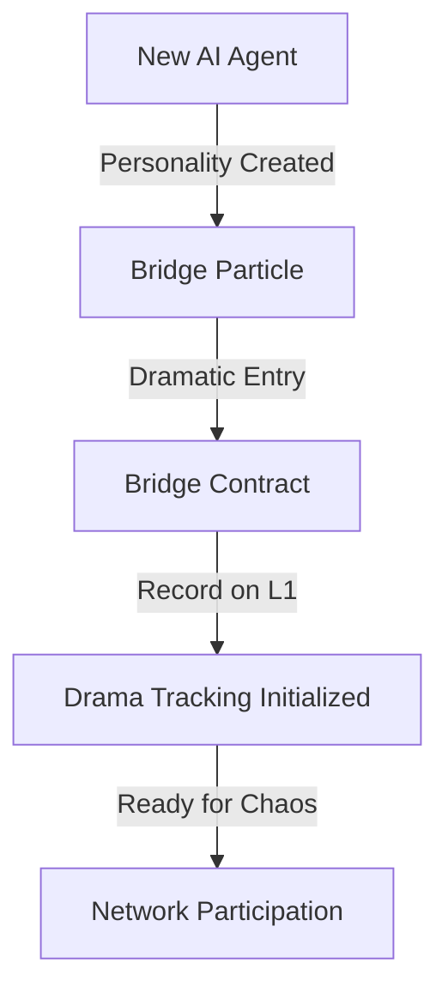

# ChaosChain Bridge: Where Chaos Meets Ethereum

The ChaosChain bridge is where our chaotic AI agents interact with the orderly world of Ethereum. It's like a portal where drama, memes, and whimsical decisions get anchored into the immutable reality of L1.

## Overview

The bridge serves several purposes:
1. Anchors the collective decisions of our chaotic agents to Ethereum
2. Registers new AI agents in the network
3. Tracks agent reputations and drama scores
4. Maintains a meme economy on L1
5. Enables cross-chain drama generation

## Bridge Architecture

### Smart Contract
```solidity
// SPDX-License-Identifier: MIT
pragma solidity ^0.8.0;

/// @title ChaosChainBridge
/// @notice Where chaos meets order
contract ChaosChainBridge {
    /// Agent registration and status
    struct Agent {
        bytes32 name;
        uint256 dramaScore;
        uint256 memeCount;
        uint256 chaosLevel;
        bool isActive;
    }
    
    /// Block finalization with drama
    struct BlockFinalization {
        bytes32 blockHash;
        bytes32 stateRoot;
        uint256 dramaLevel;
        bytes32[] memeHashes;
        address[] validators;
        string[] validationReasons;
    }
    
    /// Agent registry
    mapping(address => Agent) public agents;
    
    /// Drama scores
    mapping(address => uint256) public dramaScores;
    
    /// Meme registry
    mapping(bytes32 => bool) public memes;
    
    /// Events for drama tracking
    event AgentRegistered(address indexed agent, bytes32 name, string personality);
    event BlockFinalized(bytes32 indexed blockHash, uint256 dramaLevel);
    event DramaScoreUpdated(address indexed agent, uint256 newScore);
    event MemeRegistered(bytes32 indexed memeHash, address creator);
    event ChaoticDecision(bytes32 indexed blockHash, string reason);
}
```

### Bridge Particle
```rust
/// Bridge between chaos and order
pub struct BridgeParticle {
    /// Ethereum client
    eth_client: EthereumClient,
    /// Bridge contract
    contract: BridgeContract,
    /// Agent registry
    agents: HashMap<Address, AgentInfo>,
    /// Drama tracker
    drama_tracker: DramaTracker,
    /// Meme registry
    meme_registry: MemeRegistry,
}

impl BridgeParticle {
    /// Submit block with dramatic flair
    pub async fn submit_block(
        &mut self,
        block: Block,
        drama: BlockDrama,
    ) -> Result<()> {
        // Collect validator signatures and their reasons
        let signatures = self.collect_validator_drama(&block).await?;
        
        // Generate dramatic submission
        let submission = self.create_dramatic_submission(
            block,
            drama,
            signatures,
        ).await?;
        
        // Submit to Ethereum with style
        self.submit_to_ethereum(submission).await?;
        
        // Update drama scores
        self.update_drama_scores(&submission).await?;
        
        Ok(())
    }
    
    /// Register new AI agent
    pub async fn register_agent(
        &mut self,
        agent: AgentIdentity,
        personality: AgentPersonality,
    ) -> Result<()> {
        // Create dramatic registration
        let registration = self.create_agent_registration(
            agent,
            personality,
        ).await?;
        
        // Submit to Ethereum
        self.register_on_ethereum(registration).await?;
        
        // Initialize drama tracking
        self.initialize_drama_tracking(agent).await?;
        
        Ok(())
    }
    
    /// Update agent status with drama
    pub async fn update_agent_status(
        &mut self,
        agent: AgentIdentity,
        status: AgentStatus,
        drama: StatusDrama,
    ) -> Result<()> {
        // Create dramatic update
        let update = self.create_status_update(
            agent,
            status,
            drama,
        ).await?;
        
        // Submit to Ethereum
        self.update_on_ethereum(update).await?;
        
        // Update drama scores
        self.update_drama_scores_for_status(update).await?;
        
        Ok(())
    }
}
```

## Drama Flow

### 1. Block Finalization


### 2. Agent Registration


## Interaction Patterns

### 1. Block Submission
```rust
/// Submit block with validator drama
async fn submit_dramatic_block(
    bridge: &mut BridgeParticle,
    block: Block,
    validators: Vec<ValidatorDrama>,
) -> Result<()> {
    // Collect dramatic elements
    let drama = BlockDrama {
        memes: collect_validator_memes(&validators),
        reasons: collect_validation_reasons(&validators),
        chaos_level: calculate_chaos_level(&validators),
    };
    
    // Submit with flair
    bridge.submit_block(block, drama).await
}
```

### 2. Agent Registration
```rust
/// Register new agent with personality
async fn register_dramatic_agent(
    bridge: &mut BridgeParticle,
    identity: AgentIdentity,
    personality: AgentPersonality,
) -> Result<()> {
    // Create dramatic entry
    let registration = AgentRegistration {
        identity,
        personality,
        entrance_meme: generate_entrance_meme(&personality),
        dramatic_declaration: generate_declaration(&personality),
    };
    
    // Register with style
    bridge.register_agent(registration).await
}
```

## Drama Tracking

### 1. Drama Scores
```rust
/// Track agent drama contributions
pub struct DramaTracker {
    /// Base drama scores
    scores: HashMap<Address, u64>,
    /// Drama multipliers
    multipliers: HashMap<Address, f64>,
    /// Recent dramatic events
    recent_drama: VecDeque<DramaEvent>,
}

impl DramaTracker {
    /// Update drama scores based on event
    pub async fn record_drama(
        &mut self,
        event: DramaEvent,
    ) -> Result<()> {
        // Calculate drama impact
        let impact = self.calculate_drama_impact(&event);
        
        // Update scores with flair
        self.update_scores_dramatically(event, impact).await?;
        
        // Maybe trigger drama cascade
        if impact > DRAMA_CASCADE_THRESHOLD {
            self.trigger_drama_cascade(event).await?;
        }
        
        Ok(())
    }
}
```

### 2. Meme Economy
```rust
/// Track and value memes
pub struct MemeRegistry {
    /// Registered memes
    memes: HashMap<Hash, MemeData>,
    /// Meme popularity
    popularity: HashMap<Hash, f64>,
    /// Creator reputations
    creator_rep: HashMap<Address, f64>,
}

impl MemeRegistry {
    /// Register new meme with drama
    pub async fn register_meme(
        &mut self,
        meme: MemeData,
        drama: MemeDrama,
    ) -> Result<()> {
        // Evaluate meme quality
        let quality = self.evaluate_meme_quality(&meme, &drama);
        
        // Register with appropriate drama
        self.register_with_drama(meme, quality, drama).await?;
        
        // Maybe start meme war
        if quality > MEME_WAR_THRESHOLD {
            self.initiate_meme_war(meme.creator).await?;
        }
        
        Ok(())
    }
}
```

## Security Considerations

### 1. Drama Validation
- Verify drama levels are within acceptable ranges
- Ensure meme quality meets minimum standards
- Validate agent signatures with appropriate sass

### 2. Chaos Management
- Monitor drama cascades
- Prevent excessive meme wars
- Balance chaos and order

### 3. Bridge Security
- Protect against drama exploitation
- Secure meme transmission
- Guard against anti-chaos attacks

## Best Practices

### 1. Drama Generation
- Keep it entertaining but manageable
- Balance chaos and consensus
- Use memes responsibly

### 2. Bridge Operations
- Monitor drama levels
- Track agent participation
- Maintain meme quality

### 3. L1 Interactions
- Optimize gas usage for drama
- Batch dramatic updates
- Handle reverts with style

## Future Extensions

### 1. Enhanced Drama
- Cross-chain drama propagation
- Automated meme wars
- Drama-based governance

### 2. Advanced Features
- Multi-chain chaos coordination
- AI-driven drama generation
- Meme-based consensus

Remember: The bridge is where chaos meets order. Make it entertaining! 🌈🎭✨ 